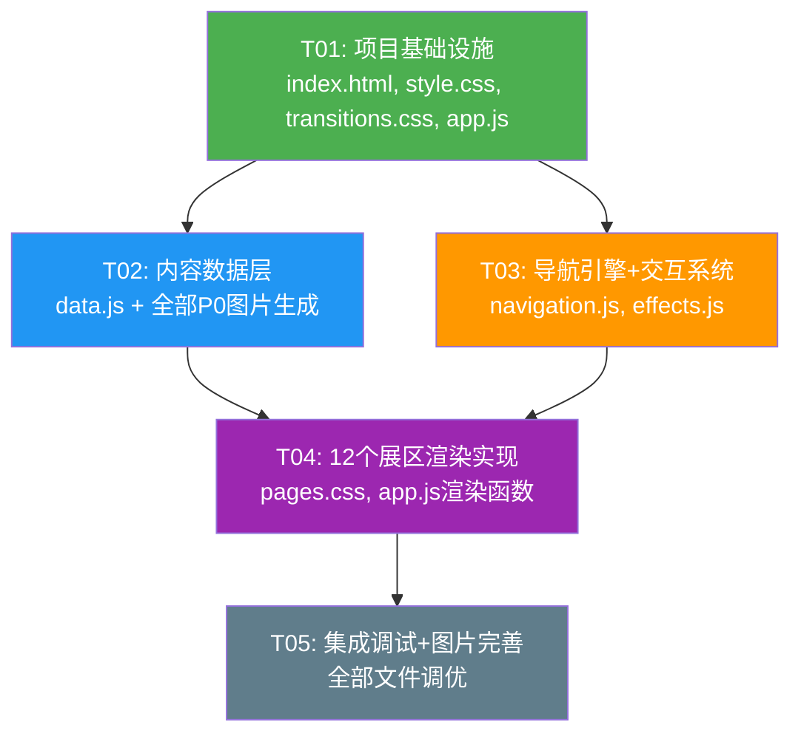

# 侨批文化数字展馆 — 架构设计文档

> **版本**: v1.0  
> **编制**: 高见远（架构师）  
> **团队**: 纸短情长济天下  
> **日期**: 2025年6月

---

## 目录

1. [文件结构](#1-文件结构)
2. [组件/模块划分](#2-组件模块划分)
3. [视觉设计系统](#3-视觉设计系统)
4. [数据/内容结构](#4-数据内容结构)
5. [交互逻辑设计](#5-交互逻辑设计)
6. [图片素材需求清单](#6-图片素材需求清单)
7. [实现任务列表](#7-实现任务列表)
8. [外部依赖](#8-外部依赖)
9. [共享知识](#9-共享知识)
10. [任务依赖关系图](#10-任务依赖关系图)

---

## 1. 文件结构

```
/
├── index.html                  # 主入口 HTML（加载所有资源）
├── css/
│   ├── style.css               # 全局样式、配色变量、字体、纹理
│   ├── pages.css               # 12 个展区各自的样式（按区号组织）
│   └── transitions.css         # 转场动画 keyframes
├── js/
│   ├── data.js                 # 内容数据层（12 展区的所有可配置数据）
│   ├── navigation.js           # 翻页引擎、键盘监听、自动播放、快速导航
│   ├── effects.js              # 特效：纸张纹理叠加、墨迹效果、光效
│   └── app.js                  # 应用入口：初始化、路由、渲染调度
└── images/                     # 所有真实图片（通过 ImageGen 生成）
    ├── cover/                  # 封面页素材
    │   ├── oil-lamp.png        # 旧式油灯
    │   ├── paper-texture-bg.png# 全局纸张纹理底图
    │   └── title-calligraphy.png # 书法标题字
    ├── envelope/               # ② 启封仪式
    │   ├── old-envelope.png    # 旧信封
    │   ├── letter-paper.png    # 信纸内页
    │   └── jian-zi-ru-mian.png # 毛笔字"见字如面"
    ├── nan/                    # ③ 「難」字页
    │   ├── nan-character.png   # 巨大毛笔字「難」
    │   └── paper-texture-light.png # 浅色纸纹理
    ├── timeline/               # ④ 历史时间轴
    │   └── timeline-scroll.png # 长卷时间轴背景
    ├── knowledge/              # ⑤ 何为侨批
    │   ├── card-icon-envelope.png  # 信封图标
    │   ├── card-icon-coin.png      # 钱币图标
    │   └── card-icon-ship.png      # 航海船图标
    ├── nanyang/                # ⑥ 下南洋
    │   ├── red-head-boat.png   # 红头船剪影
    │   ├── ocean-waves.png     # 海洋波浪纹样
    │   └── woodcut-frame.png   # 木刻版画边框
    ├── war/                    # ⑦ 烽火侨批
    │   ├── old-newspaper-bg.png    # 旧报纸背景
    │   ├── east-xing-road-map.png  # 东兴汇路地图
    │   └── zhou-enlai-reply.png    # 周恩来等联名回批
    ├── economy/                # ⑧ 经济血脉
    │   ├── blood-vein-bg.png   # 血脉脉络背景
    │   └── data-chart.png      # 侨汇数据可视化图
    ├── united-front/           # ⑨ 统一战线
    │   ├── situmeitang.png     # 司徒美堂照片
    │   ├── red-banner.png      # 红色横幅
    │   └── donation-plane.png  # 华侨捐献飞机图
    ├── stars/                  # ⑩ 人物星河
    │   ├── starry-sky-bg.png   # 星空背景
    │   ├── portrait-chenjunrui.png    # 陈君瑞象征图
    │   ├── portrait-chenlianyin.png   # 陈莲音象征图
    │   ├── portrait-yangluyi.png      # 杨露义象征图
    │   ├── portrait-linchaguang.png   # 林朝光象征图
    │   └── portrait-war-hero.png      # 抗战无名氏象征图
    ├── contemporary/           # ⑪ 当代意义
    │   ├── golden-flow.png     # 金色水流元素
    │   ├── west-dike-park.png  # 西堤公园"记忆之流"概念图
    │   └── memory-flow-bg.png  # 明亮的暖色背景
    └── ending/                 # ⑫ 尾页
        ├── oil-lamp-lit.png    # 点亮的油灯
        └── thank-you-bg.png    # 致谢背景纹理
```

### 文件职责矩阵

| 文件 | 职责 | 不负责 |
|------|------|--------|
| `index.html` | DOM 结构骨架、外部资源引用 | 样式、逻辑、数据 |
| `css/style.css` | CSS 变量、基础排版、纸张纹理、全局布局 | 页面特有样式 |
| `css/pages.css` | 12 个页面各自布局、浮动批注、卡片样式 | 全局变量、转场 |
| `css/transitions.css` | 淡入淡出、滑动、卡片滑入等 keyframes | 布局、颜色 |
| `js/data.js` | 12 展区内容（JSON 对象）、图片路径映射 | DOM 操作、事件 |
| `js/navigation.js` | 翻页、键盘监听、页码、快速导航 | 渲染、样式 |
| `js/effects.js` | 纸张纹理叠加、动画驱动、视觉效果 | 业务逻辑 |
| `js/app.js` | 初始化调度、页面渲染、事件绑定 | 具体样式 |

---

## 2. 组件/模块划分

### 2.1 页面类型分类（复用模式）

12 个展区可归纳为 **6 种页面类型**，每种类型有可复用的渲染模式：

| 类型 | 包含展区 | 描述 | 复用组件 |
|------|---------|------|---------|
| **DarkCover** | ① 封面、⑫ 尾页 | 深色背景 + 中央聚焦 + 渐变光晕 | 径向光晕、纸张纹理叠加 |
| **Envelope** | ② 启封仪式 | 信封 + 拆封 + 信纸滑出 | 信封容器、内页容器 |
| **SingleCharacter** | ③ 「難」字 | 极简全屏大字 + 批注浮现 | 大字容器、浮动批注 |
| **ScrollTimeline** | ④ 时间轴 | 横向滚动长卷 | 水平滚动容器、墨点标记 |
| **CardStack** | ⑤ 何为侨批 | 错落卡片 + 依次滑入 | 卡片容器（可复用） |
| **SplitScreen** | ⑥ 下南洋、⑦ 烽火侨批、⑨ 统一战线 | 分割/分栏 + 图文混排 | 分栏布局、图文单元 |
| **DataVisual** | ⑧ 经济血脉 | 暗色底 + 数据可视化 | 数据卡片、流线动画 |
| **StarGallery** | ⑩ 人物星河 | 星空 + 可点击星点 | 星点按钮、弹出卡片 |
| **BrightSplash** | ⑪ 当代意义 | 明亮暖色 + 渐变亮起 | 渐亮动画、暖色背景 |

### 2.2 通用 UI 组件（共享）

| 组件名 | 作用 | 使用位置 |
|--------|------|---------|
| `PageIndicator` | 右下角 "3/12" 页码 | 所有展区（全局覆盖） |
| `NavButton` | 左下角快速导航按钮 | 所有展区 |
| `QuickNavOverlay` | 快速导航缩略网格（点击 NavButton 弹出） | 全局 |
| `TooltipPopup` | 浮动说明/批注弹窗 | ③、④、⑤、⑦、⑩ |
| `PaperTextureOverlay` | 全屏纸张纹理叠加层 | 所有展区 |
| `FadeTransition` | 淡入淡出容器 | 所有展区切换 |
| `KeyboardController` | 键盘左右键监听 | 全局 |

---

## 3. 视觉设计系统

### 3.1 色彩体系（CSS 变量）

```css
:root {
  /* ===== 主色调 ===== */
  --color-old-paper:     #F5E6C8;   /* 旧纸色（主背景） */
  --color-old-paper-dark:#E8D5B0;   /* 旧纸色（深） */
  --color-ink:           #2C2C2C;   /* 墨色（正文） */
  --color-ink-deep:      #1A1A1A;   /* 墨色深（标题） */

  /* ===== 强调色 ===== */
  --color-gold:          #C9A96E;   /* 暖金（标题/装饰线） */
  --color-gold-light:    #D4A574;   /* 暖金浅（光晕） */
  --color-vermilion:     #A52A2A;   /* 朱砂红（印章/标记） */
  --color-vermilion-deep:#8B0000;   /* 朱砂深（横幅） */

  /* ===== 场景色 ===== */
  --color-night-sky:     #0A0E27;   /* 深蓝夜空（⑩） */
  --color-ocean-deep:    #1A2A3A;   /* 海蓝深（⑥） */
  --color-ocean-mid:     #2C4A5A;   /* 海蓝中（⑥） */
  --color-old-yellow:    #D4C5A9;   /* 旧报黄（⑦） */
  --color-blood:         #6B1D1D;   /* 暗红血迹（⑦） */

  /* ===== 功能性 ===== */
  --color-overlay:       rgba(0,0,0,0.6); /* 遮罩层 */
  --color-glow-warm:     rgba(212,165,116,0.3); /* 暖光光晕 */
  --color-text-shadow:   rgba(44,44,44,0.3); /* 文字投影 */
}
```

### 3.2 字体方案

| 层次 | 字体 CSS | 回退 | 使用场景 |
|------|---------|------|---------|
| 书法标题 | `'Noto Serif SC', 'STKaiti', serif` | 楷体 | 封面标题、章节名 |
| 正文字体 | `'Noto Serif SC', 'STSong', 'SimSun', serif` | 宋体 | 说明文字、故事 |
| 数据字体 | `'Noto Serif SC', 'Georgia', serif` | 衬线体 | 数据数字 |
| 装饰字体 | `'Noto Serif SC', 'KaiTi', serif` | 楷体 | 批注、图章说明 |

**引入方式**：通过 Google Fonts CDN 引入 Noto Serif SC（仅需这一个字体族，用 weight 区分层次）

### 3.3 材质纹理策略（CSS 实现）

#### 纸张纹理（全局覆盖层）

```css
/* 方案：使用 CSS 噪点纹理 + SVG filter，零外部图片依赖 */
.paper-overlay {
  position: fixed;
  inset: 0;
  pointer-events: none;
  z-index: 999;
  opacity: 0.15;
  background-image: url("data:image/svg+xml,..."); /* 极小 SVG 噪点 */
  mix-blend-mode: multiply;
}
```

实际实现使用一个极小尺寸（200×200）的噪点 PNG 纹理平铺，或者通过 CSS `background-image` 的 repeating 渐变模拟纸纹肌理。备用方案：使用背景图 `images/paper-texture-bg.png` 作为全屏覆盖。

#### 墨迹洇墨效果

```css
/* 用 CSS filter 模拟笔触边缘扩散 */
.ink-bleed {
  filter: url(#ink-bleed);  /* SVG feGaussianBlur + feTurbulence */
}
```

#### 光晕渐变

```css
/* 油灯光照：径向渐变 */
.lantern-glow {
  background: radial-gradient(
    ellipse at 50% 40%,
    rgba(212,165,116,0.25) 0%,
    rgba(44,24,16,0.6) 50%,
    rgba(44,24,16,0.95) 100%
  );
}
```

### 3.4 转场动画设计

| 转场类型 | CSS 实现 | 时长 | 使用展区 |
|---------|---------|------|---------|
| 标准淡入淡出 | `opacity 1.2s ease` | 1.2s | 所有默认转场 |
| 慢速淡出 | `opacity 1.5s ease` | 1.5s | ①→②（首转场） |
| 横向滑动 | `transform translateX` | 1.0s | ④时间轴进入 |
| 卡片滑入 | `transform translateY + opacity` | 0.6s (stagger 0.5s) | ⑤三张卡片 |
| 船只驶入 | `transform translateX` | 2.0s ease-out | ⑥红头船 |
| 渐亮 | `filter brightness(0.3→1.0) + opacity` | 2.0s | ①画面渐亮、⑦硝烟散去、⑪日出 |
| 星点放大 | `transform scale + opacity` | 0.4s | ⑩星点展开 |

### 3.5 响应式策略

- **固定视口**：以 16:9（1920×1080）为设计基准
- **CSS 适配**：使用 `aspect-ratio: 16/9` + `max-width: 100vw; max-height: 100vh`
- **缩放方式**：所有尺寸使用 `vw/vh` 相对单位或 `clamp()`，确保在投影/大屏上等比缩放
- **中心对齐**：水平垂直居中，多余空间用纯色填充
- **无需适配手机**：课堂投屏场景，仅需适配 16:9 投影仪

```css
.exhibition-container {
  aspect-ratio: 16 / 9;
  max-width: 100vw;
  max-height: 100vh;
  margin: auto;
  position: relative;
  overflow: hidden;
  font-size: clamp(14px, 1.2vw, 20px);
}
```

---

## 4. 数据/内容结构

### 4.1 顶层数据模型

```javascript
/**
 * 展馆数据主结构
 * 所有展区内容完全配置化，通过 data.js 中的 EXHIBITION_DATA 对象管理
 */
const EXHIBITION_DATA = {
  version: "1.0",
  totalZones: 12,
  author: "纸短情长济天下",

  // 全局元数据
  meta: {
    title: "侨批·纸短情长",
    subtitle: "海外华侨家书与汇款的文化记忆",
    pagePrefix: "展区",
  },

  // 12 个展区
  zones: [ /* ZoneItem[] */ ]
};
```

### 4.2 ZoneItem 结构

```javascript
/**
 * @typedef {Object} ZoneItem
 * @property {number} id - 展区编号 1-12
 * @property {string} slug - 英文标识，用于 CSS 类名和图片路径
 * @property {string} title - 展区标题（显示用）
 * @property {string} subtitle - 副标题（可选）
 * @property {string} layoutType - 布局类型: 'cover'|'envelope'|'character'|'timeline'|'cards'|'split'|'data'|'stars'|'splash'|'ending'
 * @property {string} theme - 色彩主题 class 名
 * @property {Object} content - 展区内容（见下方各类型）
 * @property {string[]} images - 该展区所需图片路径列表
 * @property {'fade'|'slideLeft'|'brighten'} transitionIn - 进入转场
 * @property {'fade'|'slideLeft'|'dim'} transitionOut - 离开转场
 * @property {number} minStaySeconds - 最低停留秒数（自动翻页前）
 * @property {boolean} autoAdvance - 是否自动进入下一页
 * @property {Object[]} [hotspots] - 可点击热点区域（可选）
 * @property {Object} [pageIndicator] - 页码样式覆盖
 */
```

### 4.3 各布局类型的内容结构

#### cover / ending（①封面 / ⑫尾页）

```javascript
{
  id: 1,
  slug: "cover",
  title: "侨批·纸短情长",
  layoutType: "cover",
  theme: "theme-dark-warm",
  content: {
    headline: "侨批·纸短情长",
    subtitle: "海外华侨家书与汇款的文化记忆",
    footer: "——交互式数字展馆——",
    topLeftLabel: "纸短情长济天下",
    backgroundType: "radial-gradient", // 径向光晕
    centerImage: "images/cover/oil-lamp.png",
    showEnterHint: true, // 显示"点击进入"
    enterHintText: "点击进入"
  },
  images: ["images/cover/oil-lamp.png", "images/cover/paper-texture-bg.png"],
  transitionIn: "brighten",
  transitionOut: "fade",
  minStaySeconds: 5,
  autoAdvance: false
}
```

#### envelope（②启封仪式）

```javascript
{
  id: 2,
  slug: "envelope",
  layoutType: "envelope",
  theme: "theme-old-paper",
  content: {
    envelopeImage: "images/envelope/old-envelope.png",
    letterPaperImage: "images/envelope/letter-paper.png",
    revealText: "见字如面",
    revealTextImage: "images/envelope/jian-zi-ru-mian.png",
    description: "一封百年前的家书，等待着被开启",
    animationSequence: [
      { action: "clickToOpen", duration: 3000 },
      { action: "slideOutLetter", duration: 1500 },
      { action: "fadeInText", duration: 2000, text: "见字如面" },
      { action: "autoAdvance", delay: 2000 }
    ]
  },
  images: ["images/envelope/old-envelope.png", "images/envelope/letter-paper.png", "images/envelope/jian-zi-ru-mian.png"],
  transitionIn: "fade",
  minStaySeconds: 0, // 等待交互
  autoAdvance: false
}
```

#### character（③「難」字）

```javascript
{
  id: 3,
  slug: "nan",
  layoutType: "character",
  theme: "theme-paper-ink",
  content: {
    mainCharacter: "難",
    characterImage: "images/nan/nan-character.png",
    source: "陈君瑞侨批，1927年",
    annotation: "一字千钧——一个'難'字，道尽华侨漂泊之苦",
    annotationPosition: "right", // 批注位置
    backgroundTexture: "images/nan/paper-texture-light.png",
    showAnnotationDelay: 6000 // 6秒后自动显示批注
  },
  images: ["images/nan/nan-character.png", "images/nan/paper-texture-light.png"],
  transitionIn: "fade",
  minStaySeconds: 6,
  autoAdvance: false
}
```

#### timeline（④历史时间轴）

```javascript
{
  id: 4,
  slug: "timeline",
  layoutType: "timeline",
  theme: "theme-ink-scroll",
  content: {
    scrollImage: "images/timeline/timeline-scroll.png",
    autoScrollDuration: 8000, // 8秒自动滚完
    nodes: [
      { year: "1864", label: "最早侨批体系", xPercent: 5 },
      { year: "1927", label: "陈君瑞「難」字批", xPercent: 25 },
      { year: "1937-1945", label: "烽火侨批·抗战时期", xPercent: 45 },
      { year: "1957", label: "林朝光三千言长信", xPercent: 70 },
      { year: "1988", label: "侨汇体系收尾", xPercent: 90 }
    ]
  },
  images: ["images/timeline/timeline-scroll.png"],
  transitionIn: "slideLeft",
  minStaySeconds: 8,
  autoAdvance: true
}
```

#### cards（⑤何为侨批）

```javascript
{
  id: 5,
  slug: "knowledge",
  layoutType: "cards",
  theme: "theme-old-paper",
  content: {
    cards: [
      {
        icon: "images/knowledge/card-icon-envelope.png",
        title: "侨",
        body: "海外漂泊的游子",
        subtitle: "批 = 闽南语「信」",
        expandedText: "详细解释……"
      },
      {
        icon: "images/knowledge/card-icon-coin.png",
        title: "一封侨批 = 一封信 + 一份侨汇",
        body: "既是家书，又附汇款",
        expandedText: "详细解释……"
      },
      {
        icon: "images/knowledge/card-icon-ship.png",
        title: "跨越山海的情感纽带",
        body: "1864-1988年持续124年",
        expandedText: "详细解释……"
      }
    ],
    staggerDelay: 500 // 每张卡片延迟 0.5 秒
  },
  images: ["images/knowledge/card-icon-envelope.png", "images/knowledge/card-icon-coin.png", "images/knowledge/card-icon-ship.png"],
  transitionIn: "fade",
  minStaySeconds: 12,
  autoAdvance: true
}
```

#### split（⑥⑦⑨分栏 / 图文混排）

```javascript
{
  id: 6,
  slug: "nanyang",
  layoutType: "split",
  theme: "theme-ocean",
  content: {
    splitMode: "top-bottom", // 或 "left-right"
    topContent: {
      type: "image",
      src: "images/nanyang/red-head-boat.png",
      alt: "红头船",
      animation: "slideInLeft", // 从左驶入
      animationDuration: 2000
    },
    bottomContent: {
      type: "text",
      title: "下南洋",
      subtitle: "一代又一代的潮汕人，乘着红头船，漂洋过海",
      body: "1840-1940年……",
      textAlign: "center"
    },
    decorativeBorder: "images/nanyang/woodcut-frame.png",
    extraOverlay: "images/nanyang/ocean-waves.png"
  },
  images: ["images/nanyang/red-head-boat.png", "images/nanyang/ocean-waves.png", "images/nanyang/woodcut-frame.png"],
  transitionIn: "fade",
  minStaySeconds: 10,
  autoAdvance: true,
  hotspots: [
    { region: "data-btn", label: "查看人口数据", popupContent: "..." }
  ]
}
```

#### data（⑧经济血脉）

```javascript
{
  id: 8,
  slug: "economy",
  layoutType: "data",
  theme: "theme-data",
  content: {
    title: "经济血脉",
    dataPoints: [
      { value: "131.2亿", unit: "美元", label: "1864-1988年侨汇总额", description: "……", source: "……" },
      { value: "1.56亿", unit: "美元", label: "1939年侨汇", description: "与当年国民政府军费持平", source: "……" },
      { value: "持平", label: "1939年侨汇 vs 军费", description: "……", source: "……" }
    ],
    backgroundUrl: "images/economy/blood-vein-bg.png",
    dataChartImage: "images/economy/data-chart.png",
    flowAnimation: true
  },
  images: ["images/economy/blood-vein-bg.png", "images/economy/data-chart.png"],
  transitionIn: "fade",
  minStaySeconds: 15,
  autoAdvance: true
}
```

#### stars（⑩人物星河）

```javascript
{
  id: 10,
  slug: "stars",
  layoutType: "stars",
  theme: "theme-night",
  content: {
    background: "images/stars/starry-sky-bg.png",
    title: "人物星河",
    figures: [
      {
        id: "chenjunrui",
        name: "陈君瑞",
        tag: "「難」字侨批·1927年",
        portrait: "images/stars/portrait-chenjunrui.png",
        story: "……（30-50字）",
        importance: "P0"
      },
      {
        id: "chenlianyin",
        name: "陈莲音",
        tag: "卖霜女番客",
        portrait: "images/stars/portrait-chenlianyin.png",
        story: "……",
        importance: "P0"
      },
      {
        id: "yangluyi",
        name: "杨露义",
        tag: "八十一封家书",
        portrait: "images/stars/portrait-yangluyi.png",
        story: "……",
        importance: "P0"
      },
      {
        id: "linchaoguang",
        name: "林朝光",
        tag: "三千言长信·1957年",
        portrait: "images/stars/portrait-linchaguang.png",
        story: "……",
        importance: "P0"
      },
      {
        id: "war-hero",
        name: "抗战无名氏",
        tag: "毁家纾难",
        portrait: "images/stars/portrait-war-hero.png",
        story: "……",
        importance: "P0"
      }
    ]
  },
  images: [
    "images/stars/starry-sky-bg.png",
    "images/stars/portrait-chenjunrui.png",
    "images/stars/portrait-chenlianyin.png",
    "images/stars/portrait-yangluyi.png",
    "images/stars/portrait-linchaguang.png",
    "images/stars/portrait-war-hero.png"
  ],
  transitionIn: "fade",
  minStaySeconds: 0, // 需逐个点击
  autoAdvance: false
}
```

#### splash（⑪当代意义）

```javascript
{
  id: 11,
  slug: "contemporary",
  layoutType: "splash",
  theme: "theme-bright",
  content: {
    title: "纸短情长·精神永续",
    body: "侨批不仅是过去的记忆，更是数字时代文化自信的活水源泉",
    quote: "每一封侨批都是一条文化DNA链",
    backgroundOverlay: "images/contemporary/memory-flow-bg.png",
    flowElement: "images/contemporary/golden-flow.png",
    decorativeImage: "images/contemporary/west-dike-park.png",
    externalLink: { label: "了解更多", url: "#" }
  },
  images: ["images/contemporary/golden-flow.png", "images/contemporary/west-dike-park.png", "images/contemporary/memory-flow-bg.png"],
  transitionIn: "brighten",
  minStaySeconds: 15,
  autoAdvance: true
}
```

---

## 5. 交互逻辑设计

### 5.1 翻页机制

```
用户操作 → NavigationController.handleInput()
  ├── 点击画面右侧（50%区域）→ nextPage()
  ├── 点击画面左侧（50%区域）→ prevPage()
  ├── 键盘 → (→) nextPage() / (←) prevPage()
  ├── 底部快速导航按钮 → toggleQuickNav()
  └── 点击热点区域 → showPopup(hotspotId)
```

**核心规则**：
- 当前页面动画/交互未完成时，阻止翻页（通过 `isTransitioning` 锁）
- 第①页需要等待淡入完成（5s）后才显示"点击进入"
- 第②页点击信封触发拆封动画，动画结束后才能翻页
- 第⑩页需要点击人物故事，或所有故事看完后出现"继续"按钮
- 第⑫页自动停留15秒后渐暗至黑屏

### 5.2 自动播放机制

```javascript
const AUTO_ADVANCE_CONFIG = {
  enabled: true,        // 全局开关
  defaultDelay: 12000,  // 默认12秒自动翻页
  perZoneOverrides: {   // 各展区覆盖
    1: { enabled: false },        // 封面等点击
    2: { enabled: false },        // 信封等交互
    3: { delay: 6000 },           // 6秒后浮现批注
    4: { delay: 10000 },          // 时间轴滚动+间隔
    10: { enabled: false },       // 人物需手动点击
    12: { delay: 15000 }          // 尾页停留15秒后渐黑
  }
};
```

**逻辑**：每个展区进入时启动一个计时器，计时器到后自动调用 `nextPage()`。用户主动交互（翻页/点击热点）会重置计时器。

### 5.3 快速导航方案

- **触发方式**：点击画面左下角的「☰ 导航」按钮（半透明，hover 时变明显）
- **UI 方案**：弹出半透明遮罩，以 3×4 网格显示 12 个缩略预览（小图标 + 编号）
- **操作**：点击任意格直接跳转；点击遮罩空白处关闭
- **键盘快捷键**：按数字键 1-9 直接跳转到对应展区（0 跳转⑩，- 跳转⑪，= 跳转⑫）

### 5.4 页码指示器

- **位置**：右下角，距边距 24px
- **样式**：半透明小字 `"3 / 12"` 或 `"03 / 12"`
- **行为**：始终显示，翻页时跟随变化
- **避免破坏沉浸感**：使用很小的字号（12px）、半透明（0.5）、与背景融合

### 5.5 证据弹窗逻辑

```javascript
/**
 * 用于展区内热点点击后的详情展示
 * 适用展区：③批注浮现、④时间轴节点、⑤卡片展开、⑦热点区域、⑧数据来源、⑩人物故事
 *
 * 行为规范：
 * - 弹窗从下方滑入或原地放大
 * - 点击弹窗外区域关闭
 * - 弹窗内可包含图片+文字
 * - 弹窗打开时自动暂停自动翻页
 * - 关闭弹窗后恢复自动翻页计时
 */
function showEvidencePopup(content) {
  // content: { title, body, image?, source? }
  // 创建浮层，CSS class: .evidence-popup
  // 动画：opacity 0.3s + transform translateY(20px→0)
  // 关闭：点击遮罩或关闭按钮
}
```

### 5.6 状态管理

采用极简的状态对象（不需要外部状态管理库）：

```javascript
const STATE = {
  currentZone: 1,          // 当前展区编号 1-12
  isTransitioning: false,  // 转场锁
  autoPlayTimer: null,     // 自动播放计时器 ID
  hasVisited: [false]*12,  // 已访问标记
  zoneStates: {            // 各展区内部状态
    2: { isOpened: false, isRevealed: false },
    3: { isAnnotated: false },
    4: { scrollProgress: 0 },
    5: { activeCard: null },
    7: { activeHotspot: null },
    10: { viewedFigures: [], activeFigure: null }
  }
};
```

### 5.7 完整生命周期

```
1. 页面加载 → app.init()
   ├── 加载图片预缓存
   ├── 渲染第①页（封面暗色渐亮）
   ├── 绑定键盘事件
   ├── 显示页码指示器
   └── 启动自动播放（第①页等待5s）

2. 用户翻页 → navigation.nextPage()
   ├── 设置 isTransitioning = true
   ├── 当前页执行 transitionOut 动画
   ├── 新页执行 transitionIn 动画
   ├── 更新 STATE.currentZone
   ├── 更新页码指示器
   ├── 设置 isTransitioning = false
   └── 启动新页面的自动播放计时器

3. 快速导航 → navigation.jumpTo(zoneId)
   ├── 关闭快速导航面板
   ├── 直接替换当前内容（短暂淡出→淡入）
   ├── 更新所有状态变量
   └── 重置自动播放计时器
```

---

## 6. 图片素材需求清单

所有图片通过 AI 图像生成（ImageGen），风格统一为 **画册质感、旧纸美学、暖色调**。

### 6.1 全局通用

| # | 文件名 | 内容描述 | 风格要求 | 尺寸 | 优先级 |
|---|--------|---------|---------|------|--------|
| G1 | `paper-texture-bg.png` | 旧纸纹理底图，米黄色，有细微纤维肌理和轻微破损感 | 逼真纸张扫描质感 | 1920×1080 | P0 |
| G2 | `paper-texture-light.png` | 浅色纸纹理，较白净，轻微噪点 | 细腻水彩纸纹理 | 1920×1080 | P1 |

### 6.2 ① 封面页

| # | 文件名 | 内容描述 | 风格要求 | 尺寸 | 优先级 |
|---|--------|---------|---------|------|--------|
| P1-1 | `oil-lamp.png` | 一盏旧式煤油灯，金属灯座+玻璃灯罩，灯芯发出暖黄色光晕，剪影或深色手绘风格 | 水墨/手绘风格，深色背景上发光 | 800×1000 | P0 |
| P1-2 | `title-calligraphy.png` | 书法字"纸短情长济天下"，毛笔行楷，纵向排列，墨色 | 宣纸上毛笔书法，轻微洇墨 | 400×600 | P1 |

### 6.3 ② 启封仪式

| # | 文件名 | 内容描述 | 风格要求 | 尺寸 | 优先级 |
|---|--------|---------|---------|------|--------|
| P2-1 | `old-envelope.png` | 旧信封正面，米黄色，右上角有邮票，中间有模糊的收件地址（竖排），边角有磨损 | 高还原旧信封，纸质纹理，轻微岁月痕迹 | 900×600 | P0 |
| P2-2 | `letter-paper.png` | 信纸内页，竖排红色信笺格线，空白待文字浮现 | 传统信纸，红色八行格 | 800×1000 | P0 |
| P2-3 | `jian-zi-ru-mian.png` | 毛笔书法"见字如面"四个大字，竖排，墨色淋漓 | 厚重毛笔字，宣纸背景 | 500×400 | P1 |

### 6.4 ③ 「難」字页

| # | 文件名 | 内容描述 | 风格要求 | 尺寸 | 优先级 |
|---|--------|---------|---------|------|--------|
| P3-1 | `nan-character.png` | 巨大毛笔字"難"，占画面70%面积，墨色浓重，笔触清晰可见，边缘有轻微洇墨效果 | 书法大字特写，高对比度墨色，建议参考1927年陈君瑞侨批原件风格 | 1400×1000 | P0 |

### 6.5 ④ 历史时间轴

| # | 文件名 | 内容描述 | 风格要求 | 尺寸 | 优先级 |
|---|--------|---------|---------|------|--------|
| P4-1 | `timeline-scroll.png` | 横向长卷，宣纸纹理底，毛笔笔触曲线贯穿，5个墨点标记（1864/1927/1937/1957/1988），朱砂红标注年份 | 水墨长卷风格，留白充足 | 4000×800（长卷） | P0 |

### 6.6 ⑤ 何为侨批

| # | 文件名 | 内容描述 | 风格要求 | 尺寸 | 优先级 |
|---|--------|---------|---------|------|--------|
| P5-1 | `card-icon-envelope.png` | 旧信封简笔图标，印章风格 | 红色图章风格，简约 | 100×100 | P1 |
| P5-2 | `card-icon-coin.png` | 古钱币/银元图标，印章风格 | 红色图章风格，简约 | 100×100 | P1 |
| P5-3 | `card-icon-ship.png` | 帆船简笔图标，印章风格 | 红色图章风格，简约 | 100×100 | P1 |

### 6.7 ⑥ 下南洋

| # | 文件名 | 内容描述 | 风格要求 | 尺寸 | 优先级 |
|---|--------|---------|---------|------|--------|
| P6-1 | `red-head-boat.png` | 红头船侧影，潮汕标志性帆船，船头红色，帆布张开，正在破浪前行 | 木刻版画风格，暗红+黑色，线条有力 | 1200×600 | P0 |
| P6-2 | `ocean-waves.png` | 深蓝/灰蓝海面波浪纹理，抽象波浪线条 | 木刻版画波线纹样 | 1920×500 | P1 |
| P6-3 | `woodcut-frame.png` | 木刻版画风格的边框装饰纹理 | 传统木刻边框 | 1920×1080 | P2 |

### 6.8 ⑦ 烽火侨批

| # | 文件名 | 内容描述 | 风格要求 | 尺寸 | 优先级 |
|---|--------|---------|---------|------|--------|
| P7-1 | `old-newspaper-bg.png` | 旧报纸风格的半透明背景，有斑驳的旧新闻版面 | 泛黄旧报纸，岁月痕迹 | 1920×1080 | P0 |
| P7-2 | `east-xing-road-map.png` | 东兴汇路简易路线图，从东南亚经东兴到中国内陆的虚线路径 | 手绘地图风格，旧纸底色，红色虚线 | 800×600 | P1 |
| P7-3 | `zhou-enlai-reply.png` | 周恩来、叶剑英、潘汉年、廖承志联名回批的模拟图片 | 旧信纸上的毛笔回批 | 600×800 | P1 |

### 6.9 ⑧ 经济血脉

| # | 文件名 | 内容描述 | 风格要求 | 尺寸 | 优先级 |
|---|--------|---------|---------|------|--------|
| P8-1 | `blood-vein-bg.png` | 抽象的金色血脉/脉络图形，在深色背景上如血管般分支 | 金色线条，暗色背景，流动感 | 1920×1080 | P1 |
| P8-2 | `data-chart.png` | 侨汇数据的视觉化图表，展现1864-1988年侨汇增长趋势 | 简洁信息图表，暖金+朱红配色 | 1000×600 | P1 |

### 6.10 ⑨ 统一战线

| # | 文件名 | 内容描述 | 风格要求 | 尺寸 | 优先级 |
|---|--------|---------|---------|------|--------|
| P9-1 | `situmeitang.png` | 司徒美堂的肖像或象征性历史照片风格图 | 老照片风格，黑白/棕色调 | 500×600 | P1 |
| P9-2 | `red-banner.png` | 红色横幅，上书"华侨统一战线"（竖排或横排），有布纹质感 | 红色丝绸质感，金色文字 | 1000×200 | P1 |
| P9-3 | `donation-plane.png` | 华侨捐献飞机的历史意象图 | 老照片风格或木刻版画 | 600×500 | P2 |

### 6.11 ⑩ 人物星河

| # | 文件名 | 内容描述 | 风格要求 | 尺寸 | 优先级 |
|---|--------|---------|---------|------|--------|
| P10-1 | `starry-sky-bg.png` | 深蓝夜空，点缀星星，星光柔和 | 深邃星空，暖黄星点 | 1920×1080 | P0 |
| P10-2~6 | `portrait-*.png` | 五个人物的象征图（非真实肖像）：旧信封、毛笔、家书、帆船、勋章等 | 圆形构图，金色光晕环绕，旧纸色底 | 200×200 each | P0 |

### 6.12 ⑪ 当代意义

| # | 文件名 | 内容描述 | 风格要求 | 尺寸 | 优先级 |
|---|--------|---------|---------|------|--------|
| P11-1 | `golden-flow.png` | 金色水流/光流从上方流下的抽象图形 | 透明PNG，金色渐变流动感 | 1920×600 | P1 |
| P11-2 | `west-dike-park.png` | 汕头西堤公园"记忆之流"的概念再现 | 暖色调，有中西合璧建筑剪影 | 800×500 | P2 |
| P11-3 | `memory-flow-bg.png` | 明亮的暖金色渐变背景 | 暖金色到浅白渐变 | 1920×1080 | P0 |

### 6.13 ⑫ 尾页

| # | 文件名 | 内容描述 | 风格要求 | 尺寸 | 优先级 |
|---|--------|---------|---------|------|--------|
| P12-1 | `oil-lamp-lit.png` | 一盏点亮的油灯，比封面更温暖明亮，光圈温柔 | 手绘风格，暖黄光照亮周围 | 500×600 | P1 |
| P12-2 | `thank-you-bg.png` | 深暖色背景，有细微纸张纹理 | 同封面风格但稍亮 | 1920×1080 | P1 |

### 6.14 优先级汇总

| 优先级 | 数量 | 说明 |
|--------|------|------|
| **P0** | 12 张 | 核心视觉，缺失则展区无法成立 |
| **P1** | 17 张 | 重要辅助，有更好，无则用 CSS 替代 |
| **P2** | 4 张 | 锦上添花，有时间再生成 |

---

## 7. 实现任务列表

### 任务总览

| ID | 名称 | 源文件 | 依赖 | 优先级 |
|----|------|--------|------|--------|
| T01 | **项目基础设施** | `index.html`, `css/style.css`, `css/transitions.css`, `js/app.js` | 无 | P0 |
| T02 | **内容数据层** | `js/data.js`, `images/*`（全部图片生成） | T01 | P0 |
| T03 | **导航引擎 + 交互系统** | `js/navigation.js`, `js/effects.js`, `css/style.css`（新增导航样式） | T01 | P0 |
| T04 | **12 个展区渲染实现** | `css/pages.css`, `js/app.js`（渲染函数）, `images/*`（引用） | T01, T02, T03 | P0 |
| T05 | **集成调试 + 图片素材完善** | 所有文件（最终调优），补充生成 P1/P2 图片 | T04 | P1 |

---

### 任务详情

---

#### T01：项目基础设施（P0）

**依赖**：无

**源文件**：
- `index.html` — HTML 骨架、Meta、外部 CDN 引用、CSS/JS 加载
- `css/style.css` — CSS 变量定义、全局重置、纸张纹理叠加层、基础排版
- `css/transitions.css` — 所有转场动画 keyframes
- `js/app.js` — 应用入口（init 函数、DOMContentLoaded 回调、空壳结构）

**具体内容**：

1. **index.html**：
   - DOCTYPE、html lang="zh-CN"、meta viewport
   - Google Fonts CDN 加载 Noto Serif SC（权值 400/700/900）
   - 外部 CSS 加载（style.css → transitions.css → pages.css）
   - 外部 JS 加载（data.js → navigation.js → effects.js → app.js）
   - DOM 骨架：
     ```html
     <div id="app">
       <div id="exhibition-container">
         <div id="zone-renderer"></div>   <!-- 展区内容 -->
         <div id="paper-overlay"></div>   <!-- 纸张纹理 -->
         <div id="page-indicator"></div>  <!-- 页码 -->
         <div id="nav-button"></div>      <!-- 导航按钮 -->
         <div id="quick-nav"></div>       <!-- 快速导航 -->
         <div id="popup-overlay"></div>   <!-- 弹窗 -->
       </div>
     </div>
     ```

2. **css/style.css**：
   - 所有 CSS 变量（见 3.1 色彩体系）
   - 全局 reset（* { margin: 0; padding: 0; box-sizing: border-box; }）
   - body: 全屏、overflow hidden、背景纯黑
   - .exhibition-container: 16:9 固定比例、居中
   - .paper-overlay: 固定定位、指针穿透、mix-blend-mode
   - 字体回退链
   - 快速导航网格样式
   - 页码指示器样式
   - 弹窗样式

3. **css/transitions.css**：
   - `.fade-in { animation: fadeIn 1.2s ease both; }`
   - `.fade-out { animation: fadeOut 1.2s ease both; }`
   - `.slide-left-in { animation: slideLeftIn 1.0s ease both; }`
   - `.card-slide-up { animation: cardSlideUp 0.6s ease both; }`
   - `.brighten-in { animation: brightenIn 2.0s ease both; }`
   - 对应 @keyframes

4. **js/app.js**：
   - `window.addEventListener('DOMContentLoaded', init)`
   - `init()` 空壳函数，预留渲染调度入口
   - `renderZone(zoneId)` 空壳函数
   - 全局状态对象 STATE 声明

---

#### T02：内容数据层 + 图片素材生成（P0）

**依赖**：T01

**源文件**：
- `js/data.js` — 全部 12 个展区的内容数据（JSON 对象）
- 全部 `images/` 目录下的 P0 优先级图片（通过 ImageGen 生成）

**具体内容**：

1. **js/data.js**：
   - 定义 EXHIBITION_DATA 全局对象（结构见第 4 节）
   - 12 个 ZoneItem 完整数据
   - 类型常量定义（LAYOUT_TYPES, THEMES）
   - 图片路径映射对象
   - 数据验证辅助函数

2. **P0 图片生成清单**（共 12 张，优先完成）：
   - G1 `paper-texture-bg.png`（全局纸纹理）
   - P1-1 `oil-lamp.png`（油灯）
   - P2-1 `old-envelope.png`（旧信封）
   - P2-2 `letter-paper.png`（信纸内页）
   - P3-1 `nan-character.png`（難字）
   - P4-1 `timeline-scroll.png`（时间轴长卷）
   - P6-1 `red-head-boat.png`（红头船）
   - P7-1 `old-newspaper-bg.png`（旧报纸）
   - P10-1 `starry-sky-bg.png`（星空）
   - P10-2~6 五个人物象征图
   - P11-3 `memory-flow-bg.png`（暖色背景）

---

#### T03：导航引擎 + 交互系统（P0）

**依赖**：T01

**源文件**：
- `js/navigation.js` — 翻页控制、键盘监听、自动播放、快速导航
- `js/effects.js` — 纸张纹理叠加、光晕动画、视觉特效
- `css/style.css` — 需补充导航相关样式

**具体内容**：

1. **js/navigation.js**：
   - `NavigationController` 对象：
     - `nextPage()` — 翻到下一页（含转场锁）
     - `prevPage()` — 翻到上一页
     - `jumpTo(zoneId)` — 快速跳转
     - `handleKeydown(e)` — 键盘事件监听（← →）
     - `handleClick(e)` — 点击区域判断（左/右半屏）
   - 自动播放管理器：
     - `startAutoPlay()` — 启动计时器
     - `resetAutoPlay()` — 重置计时器
     - `stopAutoPlay()` — 暂停计时
   - 快速导航面板：
     - `toggleQuickNav()` — 打开/关闭
     - `renderQuickNav()` — 渲染 3×4 网格
   - 页码更新：`updatePageIndicator(zoneId)`
   - 转场锁：`isTransitioning` 标志
   - 过渡动画调度：根据 zone.transitionIn/Out 应用对应 CSS class

2. **js/effects.js**：
   - `initPaperOverlay()` — 创建纸张纹理层
   - `createLanternGlow(container)` — 径向渐变光晕
   - `fadeInElement(el, duration)` — 工具函数
   - `staggerElements(elements, delay)` — 错落入场

3. **样式补充**：
   - 快速导航网格样式
   - 页码指示器定位
   - 导航按钮样式
   - 弹窗样式
   - 转场锁的 CSS `pointer-events` 控制

---

#### T04：12 个展区渲染实现（P0）

**依赖**：T01, T02, T03

**源文件**：
- `css/pages.css` — 所有 12 个展区的布局和装饰样式
- `js/app.js` — 核心渲染函数（renderZone, renderByLayoutType）

**具体内容**：

1. **css/pages.css**：
   - 每个展区一个 CSS class（`.zone-1` ~ `.zone-12`）
   - 6 种布局类型对应的通用样式类：
     - `.layout-cover` — 中央聚焦，深色
     - `.layout-character` — 大字布局，批注定位
     - `.layout-timeline` — 水平滚动容器
     - `.layout-cards` — 卡片容器 + stagger 动画
     - `.layout-split` — 分栏布局（top-bottom, left-right）
     - `.layout-data` — 暗色数据展示
     - `.layout-stars` — 星空 + 星点定位
     - `.layout-splash` — 明亮暖色布局
   - 分展区特殊样式
   - 响应式字体大小

2. **js/app.js** 渲染函数：
   - `renderZone(zoneId)` — 主渲染路由
   - `renderCover(zone)` — ①⑫
   - `renderEnvelope(zone)` — ②
   - `renderCharacter(zone)` — ③
   - `renderTimeline(zone)` — ④
   - `renderCards(zone)` — ⑤
   - `renderSplitScreen(zone)` — ⑥⑦⑨
   - `renderDataVisual(zone)` — ⑧
   - `renderStars(zone)` — ⑩
   - `renderSplash(zone)` — ⑪
   - `createPaperOverlay()` — 全局纹理叠加

3. **展区各特殊逻辑**：
   - ② 拆封动画序列（点击 → 信封打开 → 信纸滑出 → 文字浮现）
   - ③ 大字展示 → 6秒后批注自动浮现
   - ④ 时间轴自动从左到右滚动
   - ⑤ 三张卡片 staggered 滑入
   - ⑥ 红头船从左驶入动画
   - ⑦ 画面渐亮 + 三个可点击热点区域
   - ⑧ 数据从底部流入动画
   - ⑨ 红色横幅展开
   - ⑩ 五颗星排列成弧线，点击展开故事卡片
   - ⑪ 由下而上渐亮
   - ⑫ 文字逐行浮现 → 15秒后渐暗至黑屏

---

#### T05：集成调试 + 图片素材完善（P1）

**依赖**：T04

**源文件**：所有（最终调优）

**具体内容**：

1. **集成联调**：
   - 确认 12 个展区完整流程无断裂
   - 确认转场动画流畅无卡顿
   - 确认键盘/点击/快速导航三种方式工作正常
   - 确认 16:9 比例在不同尺寸屏幕上正确显示

2. **P1/P2 图片补充生成**：
   - 生成剩余的 P1 级别图片（17 张）
   - 如有余力，生成 P2 级别图片（4 张）

3. **视觉打磨**：
   - 微调 CSS 变量配色
   - 调整转场时长和缓动函数
   - 优化快速导航面板视觉效果
   - 确保纸张纹理在所有页面上正确叠加

4. **边缘情况处理**：
   - 第①页快速翻页到其他页
   - 第⑩页未看完所有人物就翻页
   - 第②页快速点击两次信封
   - 连续快速按键导致的状态错乱

5. **浏览器兼容验证**：
   - 确认 Chrome/Firefox/Safari 最新版均正常
   - 确认 Google Fonts CDN 加载成功（教室网络环境备用方案）

---

## 8. 外部依赖

### 8.1 CDN 资源

| 资源 | CDN 地址 | 版本 | 用途 | 优先级 |
|------|---------|------|------|--------|
| **Google Fonts: Noto Serif SC** | `https://fonts.googleapis.com/css2?family=Noto+Serif+SC:wght@400;700;900&display=swap` | latest | 全站字体（正文 + 标题） | **必须** |
| **Google Fonts fallback** | 以上 URL 如加载失败，回退到系统宋体/楷体 | - | 网络不通时的后备方案 | 建议 |

### 8.2 零外部 JS 依赖

本项目 **不依赖任何外部 JavaScript 库**。所有功能用原生 JS 实现：
- 无需 jQuery
- 无需 React/Vue
- 无需 Swiper/FullPage（导航系统自实现）
- 无需 GSAP/Anime.js（动画用 CSS transitions + JS class 切换）
- 无需 Chart.js（数据图表用图片）

> **理由**：课堂展示环境可能无法访问 CDN JS 资源，且外部库会增加加载时间。纯 CSS 转场已能满足所有动画需求。

### 8.3 离线备用方案

```html
<!-- 备用字体：如 Google Fonts 加载失败，使用系统宋体 -->
<link rel="preconnect" href="https://fonts.googleapis.com">
<link rel="preconnect" href="https://fonts.gstatic.com" crossorigin>
<link href="https://fonts.googleapis.com/css2?family=Noto+Serif+SC:wght@400;700;900&display=swap" rel="stylesheet">
<style>
  /* 字体加载失败回退 */
  body { font-family: 'Noto Serif SC', 'STSong', 'SimSun', 'STKaiti', serif; }
</style>
```

---

## 9. 共享知识

### 9.1 全局规范

- **所有图片使用真实 PNG 图片**，通过 ImageGen 生成，不得使用 SVG 占位
- **所有 CSS 动画使用 class 切换**，不直接操作 style 属性动画
- **页面切换使用 isTransitioning 锁**防止并发转场
- **所有可配置内容放在 data.js 中**，不在 HTML 中硬编码
- **容器尺寸基于 16:9 比例**，通过 aspect-ratio CSS 属性实现

### 9.2 命名约定

| 类型 | 命名规则 | 示例 |
|------|---------|------|
| CSS 变量 | `--color-{name}` | `--color-old-paper` |
| CSS 类 | `.{type}-{name}` | `.zone-1`, `.layout-cover` |
| JS 函数 | `camelCase` | `nextPage()`, `renderZone()` |
| JS 变量 | `UPPER_SNAKE`（常量）/ `camelCase`（变量） | `EXHIBITION_DATA`, `currentZone` |
| 图片文件 | `{page-slug}-{description}.png` | `oil-lamp.png`, `red-head-boat.png` |
| 展区 ID | 1-12 数字 | 对应 12 个展区 |

### 9.3 跨文件数据流

```
data.js          →  EXHIBITION_DATA (全局)
app.js           →  读取 EXHIBITION_DATA，调用 renderZone()
navigation.js    →  读取 STATE，调用 app.js 的 renderZone()
effects.js       →  被 app.js 调用，操作 DOM 动画
```

所有模块通过**全局作用域**通信（单页应用，无需模块加载器）。

### 9.4 关键约束

1. 所有 HTML 内容通过 JS 动态渲染，index.html 只放容器 div
2. CSS 转场动画时长不超过 2 秒（除非特殊说明）
3. 自动翻页计时器在用户交互时立即重置
4. 快速导航面板不破坏当前页面的状态
5. 键盘事件只在页面不处于转场锁定状态时响应

---

## 10. 任务依赖关系图



### 并行说明

- **T02 和 T03 可并行执行**（二者仅依赖 T01，互不依赖）
- **T04 为最大任务**（包含 12 个展区的全部渲染逻辑），需等待 T02 和 T03 完成后开始
- **T05 为收尾任务**，时间不足时可跳过非关键 P2 图片的生成

---

*文档结束 · 架构设计 v1.0*
